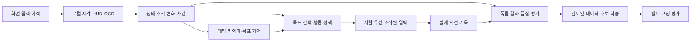
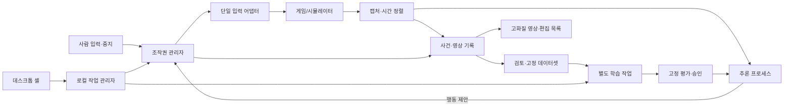
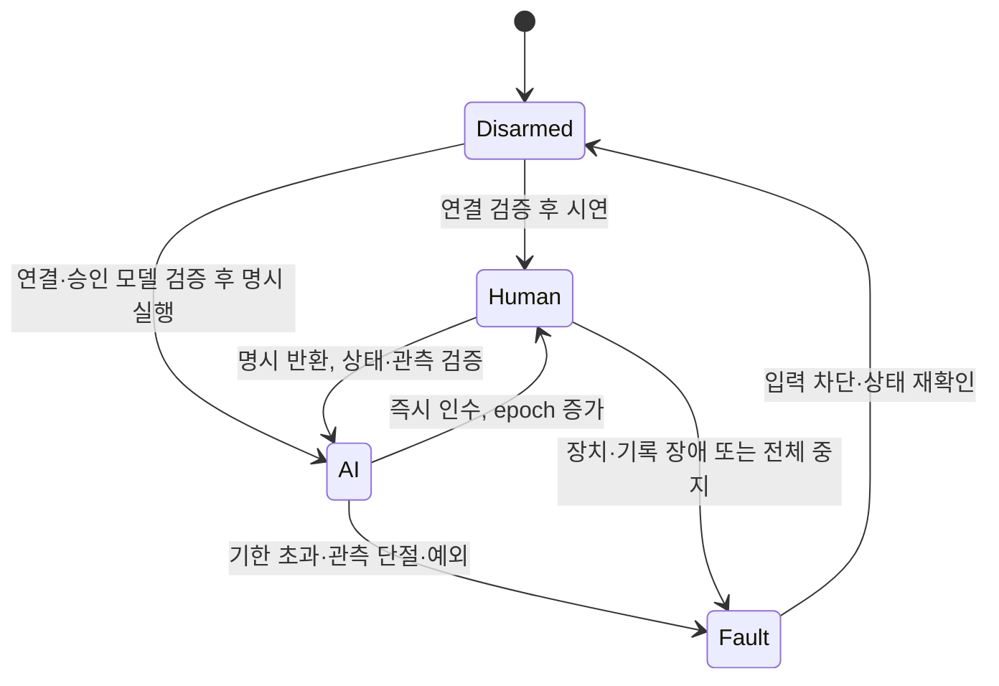

# PlayModel 구현 설계

상태: **개발 준비 명세**, 2026-09-26. 현재 코드는 환경 진단과 초안 프로필 검사 CLI다. 이 문서의 게임 연결·GUI·기록·학습·평가·영상 제작 기능은 후속 구현 대상이다. 기준 자료는 [29쪽 보존 기록](research/page-notes.md), 근거는 [1차 출처](research/sources.md), 검토 결과는 [타당성 검토](research/review.md)다.

## 목표와 첫 제품

Windows 데스크톱에서 한 게임의 짧고 반복 가능한 과제를 시연하고, AI가 실행하는 동안 사람이 조작권을 인수해 교정한다. 검토된 자료를 누적해 학습한 후보를 고정 평가로 비교한다. **교정 뒤 실제 성공률 또는 사람 의존도가 개선되고 기존 행동이 유지되는 것**이 첫 학습 성공이다.

첫 게임이 아직 없으므로 특정 장르·상용 게임·콘솔을 이미 지원한다고 표시하지 않는다. 플랫폼 연결을 위한 어댑터와 게임을 플레이하는 정책을 분리한다. 데이터 검색, 가중치 갱신, 영상 편집도 각각 독립 책임이다.

## 2026-09-27 보완 — 능력치·텍스트·자체평가

사용자가 요구한 범위는 단순 반응 조작을 넘는다. **CNN+GRU 하나만 만들면 능력치 의미·퀘스트·장기 전략·학습 효과 판정까지 갖춰진다는 설명은 부정확하다.** 저수준 행동 기준선은 유지하되 다음 모듈을 필요한 게임에서 별도로 구현·검증한다. [Pluto와 상태 인식 재검토](research/pluto-and-state-review.md), [ADR 0004](decisions/0004-local-state-and-self-evaluation.md).

| 계층 | 역할 | 검증할 구분 |
|---|---|---|
| 로컬 인식 | 장면·UI 구획, 체력바/아이콘, HUD 숫자·문자 OCR | 픽셀 인식과 글자 판독; 가림/오독/레이아웃 변경 |
| 상태 추적 | 현재/최대 체력, 기본/장비/버프 능력치, 레벨·경험치·재화·퀘스트 상태 | 관측값, 추정값, 불명, 오래된 값을 분리 |
| 변화 사건 | 레벨 증가·피해·아이템 획득·장비 교체·목표 완료 후보 | 변화 발생과 원인의 확정은 별개 |
| 의미·목표 기억 | 게임별 용어·메뉴·조건 해석, 진행 중 목표와 제약 유지 | 문자열을 읽는 것과 행동상 의미 이해는 별개 |
| 목표 선택·행동 | 필요 시 상위 목표/상태기계/학습 planner + 목표 조건부 저수준 정책 | 고정 규칙과 실제 학습된 부분을 명시 |
| 독립 평가 | 결과·진행·사망·소모·개입·오인식·퇴행 비교 | 모델 자신감, 캐릭터 성장, 정책 실력은 서로 다른 지표 |

예를 들어 최대 체력이100에서120으로 보이면, 확인된 것은 해당 표시값의 변화다. 레벨업·장비·일시 버프·OCR 오류 중 원인은 추가 사건과 문맥으로 확인한다. 체력 증가 자체를 모든 게임에서 좋은 행동의 보상으로 쓰지 않는다. 반복 장비 교체만으로 보상을 얻는 편법을 별도로 시험한다.

텍스트 의미는 처음부터 자유로운 모든 문장을 이해하는 것으로 잡지 않는다. 첫 게임의 제한된 메뉴/상태/퀘스트 어휘와 명시적 규칙을 기준선으로 두고, 동의어·부정·수량·조건·순서·미지 문장에 대한 보류 동작을 평가한다. 학습한 분류기/문장 인코더는 이 기준선과 비교한다. 더 넓은 언어 추론이 필요하면 로컬 모델을 별도 실험할 수 있지만,6GB에서 충분한 품질·동시 실행 성능을 보장하지 않는다. GPT나 외부 API로 자동 대체하지 않는다.

사람이 열어 둔 메뉴를 읽는 기능과 정책이 메뉴를 열고 조작하는 기능은 별도 capability다. 후자는 M1에서 게임 소유의 인벤토리·스탯·퀘스트 메뉴만 UI mode/action spec 허용 목록으로 선언한 뒤 검증한다. 허용 전에는 행동 정책이 메뉴를 탐색하지 않는다. 리셋·계정·시스템·결제 메뉴는 일반 행동 정책 밖의 운영 경로로 유지한다.

`StateObservation` 예정 계약: field ID, raw text/bar evidence, typed value/unit, current/base/max/buff 등 의미 종류, ROI/frame ref, capture/available ns, parser/OCR/schema version, confidence, validity/unknown reason. `StateChange`에는 이전/현재 관측 참조와 비교 조건, 변화량, 확인 완료 시각, 원인 가설과 확정 여부를 둔다. 여러 프레임으로 안정화한 사건은 **확인 완료 뒤**에만 정책이 사용할 수 있다. 미래 관측으로 확인한 값을 과거 정책 입력에 채워 넣지 않는다.

OCR·상태 parser를 정책과 함께 재학습/수정하면 보상·평가 의미도 바뀔 수 있다. 평가용 parser 버전을 고정하고, 그 parser의 사람 정답 대조 정확도를 먼저 검증한다. OCR의 confidence 점수를 보정된 정답 확률로 가정하지 않는다. 불확실한 수치는0이나 실패로 치환하지 않고 보류·검토 대상으로 기록한다. 원본/파생 OCR 자료도 기존 세션·출처 분할을 따른다.

### 자체 플레이와 평가의 경계

자율 플레이는 혼자 실행, 자체평가는 실행 결과를 기준과 비교, 자가대전은 상대 정책과 대결, 재학습은 가중치 갱신이다. 서로 자동으로 성립하지 않는다. 모델의 예상 승률이나 자기 해설을 정답 판정으로 쓰지 않는다. 실패 원인 자동 분석은 증거를 연결한 가설이며, 확인 전 교정 라벨로 승격하지 않는다.

평가는 두 조건을 구분한다. **동일 캐릭터 능력치·장비·시작 조건에서의 정책 실력**과 **실제 캠페인에서 캐릭터가 성장하는 진행 성과**다. 캐릭터가 강해져 쉽게 승리한 결과만으로 학습 개선을 주장하지 않는다. 중단·보류·오인식도 분모와 함께 보고한다. 자체평가 결과를 학습에 사용한 조건은 최종 미관측 시험에서 분리한다.

기본 관측 경로는 화면과 실제 입력이다. 허용된 구조화 게임 API를 정책 입력으로 쓰는 실험은 별도 `observation_access`와 평가 트랙으로 명시한다. API를 평가 정답에만 사용한다면 정책 특징·캐시·보상 경로를 통해 의도하지 않은 상태가 누출되지 않는지 확인한다. Pluto의 BWAPI 기반 실행 성과를 화면/OCR 정책 성과와 직접 비교하지 않는다.

### GPT·토큰 의존성

플레이·OCR·상태 해석·학습·자체평가 모두 로컬 경로로 설계한다. 외부 GPT 호출, 유료 토큰 API, 외부 LLM 평가자는 필수가 아니며 기본 구성에 넣지 않는다. OCR/로컬 언어모델이 내부 문자열을 토큰화하더라도 API 사용료와는 다른 개념이다. 개발 중 Astra 사용 비용은 제품 운영 비용과 별개다.

필요한 패키지·가중치를 미리 확보한 뒤 프로그램의 외부 네트워크를 차단한 상태에서 위 전체 흐름을 검증한다. 자동 모델 다운로드·클라우드 fallback·원격 telemetry도 검사한다. 게임 자체의 온라인 연결 필요 여부는 별도다. 현재 코드는 준비 CLI뿐이므로 이 전체 오프라인 흐름이 이미 구현·실증되었다고 보고하지 않는다.

## 프로그램 화면과 실행 구조

기본 셸은 **PySide6 Qt Widgets**를 권장한다. Python 학습·장치 코드와 같은 언어를 쓰고 파일/타임라인 중심 작업을 구성하기 쉽다. 브라우저 서버·계정·클라우드는 첫 제품에 필요하지 않다. Qt/PySide는 [공식 Python 바인딩](https://doc.qt.io/qtforpython-6/gettingstarted.html)이다. 실제 패키징/배포 전 선택 버전의 라이선스 조건도 확인한다.

| 화면 | 사용자가 하는 일 | 반드시 보여줄 상태 |
|---|---|---|
| 게임 준비 | 게임/과제/시작 상태·캡처/입력·성공 판정 설정, 미리보기/연결 검사 | 미정 항목, 연결 가능 범위, 조작 차단 상태 |
| 시연·플레이 | 시연 기록, 승인 정책 실행, 인수/명시 반환/전체 중지 | 사람/AI 소유자, 녹화 상태, 실제 전송, 관측 지연, 오류 |
| 교정 검토 | 개입 전·중·후 타임라인 탐색, 정답 구간/이유 승인 | 출처/품질/정렬 불확실 구간, 데이터 버전 |
| 학습·비교 | 고정 데이터로 후보 학습, 이전 모델과 평가, 승인/복구 | 실제 성공/개입/퇴행/지연, 학습 중과 승인됨 구분 |
| 영상 만들기 | 평가/교정 장면 선택, 자막·지표·해설 편집 준비, 로컬 내보내기 | AI/사람 개입 표시, 모델/시행 출처, 원본 연결, 검수 상태 |

학습·디코딩·추론을 GUI 이벤트 루프에서 실행하지 않는다. UI 프로세스는 로컬 작업 관리자와 제한된 명령/이벤트 IPC로 통신한다. 런타임 프로세스의 조작권 관리자가 유일한 입력 writer이며 모델은 제안만 반환한다. GUI가 응답하지 않아도 런타임이 독립된 인수/중지 신호를 받는다. 런타임 자체 종료에 대비한 외부 watchdog은 대상 입력 장치가 지원하는 종료/해제 경로와 함께 M2에서 검증한다.

처음에는 플레이/녹화와 학습을 번갈아 수행한다. 추론에는 최신 프레임 슬롯1개와 유한 대기열을 사용한다. 추론 결과는 `obs_id`, `decision_id`, `control_epoch`, `expires_at`을 포함하고, 기한 초과/인수 이전 epoch의 결과는 전송하지 않는다. 이 규칙으로 늦게 끝난 모델이 사람 인수 뒤 다시 입력하는 경쟁 상태를 막는다.

## 코드 경계

| 모듈 | 입력/출력·책임 | 완료 시 증거 |
|---|---|---|
| `cli`, `doctor`, `profiles` | 현재 준비 CLI·장치 정보·엄격한 초안 설정 검사 | 구조 검사/오류·미정 항목 동작 테스트 |
| `contracts` | 사건·관측·행동·결과·버전 타입/검증 | 인과·단위·nullable·범위 거부 테스트 |
| `adapters` | capture/input/reset/result capability, 게임 프로필 | 선택 게임 관측·전송·리셋 반복 시험 |
| `perception` | HUD/ROI/숫자·문자 인식, 원본 해상도와 행동용 화면 연결 | 라벨 대조 정확도·보류율·가용 시각·지연 |
| `state` | 관측값·신뢰 상태·만료·변화 사건의 버전 관리 | 전후 값/원인 분리, 중복·stale·미래 정보 거부 |
| `goals` | 게임별 문구 의미·미해결 목표·UI mode, 필요한 상위 계획 | 부정·조건·미지 문구, 목표 기억·메뉴 허용 범위 |
| `control` | 소유권·단일 writer·기한·watchdog·중지 | 인수/반환/지연 결과/장애 주입 시험 |
| `recording` | append-only 원본 사건·영상·시계 대응 | 탭 보존·누락 표시·중단 후 파일 복구 |
| `datasets` | 검토 라벨·품질·동결 manifest·분할·보관 | 누출 탐지·참조 무결성·보호 자료 삭제 거부 |
| `learning` | 화면 BC, 순환 BC, 누적 교정; 이후 조건부 RL | 데이터/설정/시드/학습 로그/후보 묶음 |
| `evaluation` | 고정 조건 실행·독립 결과 판정·성장/정책 지표·승인/복구 | 판정기 정답 대조, 독립 test 결과와 비교 근거 |
| `media` | 세션 시간축↔고화질 소스↔편집 목록 | 영상 시간 매핑·개입 표기·출력 검수 |
| `app` | 위 기능의 셸, 작업 상태 표시 | 실사용 시연→검토→비교→영상 흐름 |

예정 모듈은 기능 구현 때 추가한다. 빈 패키지나 `NotImplemented`를 실행 가능한 프로그램으로 표시하지 않는다. 현재 JSON 프로필 `format_version=1`은 **준비 형식**이다. 게임 연결·시계 오차·축 범위·보관·정책 묶음의 상세 런타임 스키마를 담기 시작하면 별도 schema version/migration을 추가한다. `configuration_complete=true`여도 `runtime_ready=false`를 유지하는 현재 CLI의 의미를 바꾸지 않는다.

## 데이터 계약

보존할 원문 필드는 [page-25](research/page-notes.md#page-25)를 따른다. 구현 시 아래 타입/인과 조건을 추가한다. 시계는 세션별 `monotonic_ns` 정수, 사람이 읽을 세션 시작 UTC는 별도 ISO8601이다. 프로세스/장치 시계는 동일하다고 가정하지 않고 `clock_id`와 offset/drift/uncertainty를 기록한다. 영상 PTS는 정수값+유리수 timebase로 보존한다.

| 계약 | 필수 내용 | 불변식 |
|---|---|---|
| Observation | session/episode/obs ID, frame ref, capture/available ns, PTS/timebase, quality | 사용 관측 `available_ns <= decision_ns`; 미래 프레임 불가 |
| HumanInputEvent | 사건 ns, raw buttons/axes, device ID, sequence | 영상 FPS와 무관하게 press/release/축 변화 보존 |
| PolicyProposal | policy bundle ID, obs/decision ID, epoch, proposed state, selected log-prob(필요 시), deadline | 아직 실제 입력이 아님; 리셋/시스템 메뉴 제외, 게임 메뉴는 별도 허용 UI mode/action spec 필요 |
| SendResult | sent state/time, source, sequence, adapter result, acknowledgment, applied state | 전송 성공·수신·게임 적용 구분. 미확인은 `unknown`/null |
| AuthorityEvent | old/new owner, epoch, takeover/release ns, reason | 한 시점 최종 입력 주체 하나 |
| Transition | o_t ref, sent action ref, reward/method, next obs ref, terminated/truncated/reason | 마지막 관측이 없으면 invalid; 보상 미정은0으로 대체하지 않음 |
| ReviewLabel | version, reviewer, valid time range, BC mask, reason | 원본 수정 금지; AI/미검토 시점 정답 불가 |
| DatasetManifest | 원본 hashes, ranges, label/alignment/preprocess/action versions, split groups | 불변 목록, 그룹 간 원본/파생물 겹침 없음 |
| ModelBundle | weights hash, architecture/config, action/preprocess specs, dataset/version, eval record | 전체 묶음 호환 검사 후 로드 |

`ControllerState`는 선언된 버튼의 bool 상태, D-pad 범주, 정규화 축 값을 완전한 상태로 표현한다. 축의 원본 범위/정규화/데드존/구간화 규칙을 행동 spec에 둔다. 알 수 없는 버튼, NaN/Inf, 범위 밖 값, 금지 조합은 전송 전에 거부한다. 활성 장치에 없는 출력은 모델/손실에서 제외한다.

사람의 실제 인지·결정 시각은 측정할 수 없을 수 있다. 이때 입력 이벤트 시각을 decision의 **대리값**으로 사용했음을 표시하고 표시 경로 지연/불확실 구간을 기록한다. 임의 반응시간만큼 모든 라벨을 과거로 미는 보정은 하지 않는다. 원본은 수정하지 않고 정렬 파생 버전으로 실험한다.

초기 기록 저장은 UTF-8 JSONL 사건 + SQLite 로컬 인덱스 + 압축 영상/PTS 매핑을 권장한다. 원본 파일은 append 후 종료 시 hash를 확정한다. crash 시 partial로 남기고 검증 전 학습에서 제외한다. 학습량이 커지면 Parquet export를 추가하되 사건 원본/ID/단위/보상 위치를 왕복 시험한다. [RLDS](https://github.com/google-research/rlds)와 [LeRobot v3](https://huggingface.co/docs/lerobot/en/lerobot-dataset-v3)의 구조를 참고하며 전체 프레임워크 설치는 필수가 아니다.

## 조작권과 장애

소유권 교체는 최종 상태를 원자적으로 대체한다. 정상 인수는 사람 버튼 상태로 바꾸며, 항상 전체 해제 후 누름을 삽입하지 않는다. fault에서는 자동 추가입력을 차단하고 검증한 어댑터의 해제/중립 요청을 수행한다. 템플릿 `neutral_on_fault=true`는 이 요청 의도이며 장치 수신·게임 안전 보증이 아니다. 실패하면 unknown으로 표시하고 명시적인 재연결 전 재전송하지 않는다.

원안30Hz는 학습 비교 후보, 현 템플릿10Hz/250ms watchdog는 준비 단계 측정 제안이다. 10Hz가 빠른 액션에 충분하거나250ms가 안전하다는 뜻이 아니다. 실제 캡처→전송 p50/p95/p99, 관측 나이, 최대 입력 유지, 인수 반응을 측정해 게임별 값을 정한다. 30Hz 실시간을 채택하려면 계산·전송 기한이33.3ms 주기에 맞아야 하며 캡처 나이 예산도 별도 충족해야 한다.

## 첫 학습 모델과 교정

1. **화면 단독 BC 기준선**: 전체 영역 letterbox RGB320×180, ResNet18급 frozen encoder, 작은 출력 head. 모델 형상과 데이터 정렬을 먼저 증명한다.
2. **시간 기준선**: CNN 특징의 3×5 격자→256 투영, 최근4 특징 + 실제 직전 입력64 + dt/나이/유효성→512 투영→GRU512×1→행동 head. 화면 단독과 같은 데이터/평가 예산으로 비교한다.
3. **사람 교정**: 기존 시연+누적 검토 교정+대표 정상 자료로 retrain. AI 문맥은 hidden 갱신에만 쓰고 해당 시점 BC 손실은 mask0. 전·중·후 인수 경계의 불확실 라벨 제외. 복구뿐 아니라 예방 시연을 모은다.

위 숫자는 [원안 초기값](research/page-notes.md#page-24)이다. 128시점(준비32+손실96)은 실험 후보이며 VRAM 측정 후 축소할 수 있다. 같은 시간 길이를 비교하려면 Hz 변경에 맞춰 시점 수를 재설정한다. hidden은 현재 모델로 burn-in에서 다시 만들고, reset/단절/모델 변경에서 초기화한다. 사람 인수 중에도 실제 전송 행동으로 갱신한다. CNN 역전파는 프레임 microbatch/짧은 구간부터, GRU는 TBPTT 경계 detach 규칙을 명시한다.

**캐시 경계:** CNN을 고정해도256차원 투영층이 학습 중이면 투영 이전의 공간 특징을 캐시한다. 투영까지 고정한 경우에만256차원 캐시를 재사용한다. cache key는 원본 frame hash+encoder weights+전처리+pooling+dtype+증강 설정이다. encoder를 풀거나 전처리를 바꾸면 무효화한다. 30Hz 기준 `[512,3,5]` float16은 계산상1.65888GB/h,256차원 float16은55.296MB/h다. 캐시도 보관 예산에 포함한다.

첫 과제가 적은 버튼 조합이면 게임별 합법 복합 상태를 categorical로 열거하는 작은 기준선을 허용한다. 일반 컨트롤러에는 원안의 조건부 head를 사용하되 독립 head/합법 조합 기준선과 비교해 복잡성의 이득을 측정한다. 버튼/축 규격 변경은 별도 model bundle이며 게임 간 정답을 섞지 않는다.

## 조건부 강화학습

검증된 보상, 반복 가능한 reset, 충분한 자율 수집 성능, 출처·로그확률·최종 관측 계약이 모두 준비된 뒤 별도 단계로 시작한다. recurrent PPO 라이브러리를 택해도 기존 LSTM 구현이 GRU와 사용자 정의 복합 분포를 그대로 지원한다고 가정하지 않는다. 순환 상태 reset·burn-in·마스크·분포 log-prob 시험을 먼저 만든다.

`terminated`는 실제 환경 종료, `truncated`는 외부 제한이다. 정상 시간제한에서 유효한 마지막 관측이 있으면 bootstrap할 수 있지만 관측 손상·인수 이후 오염 궤적은 별도 마스크/격리다. 두 플래그를 하나의 done으로 합치지 않는다. [Gymnasium 종료 처리](https://gymnasium.farama.org/tutorials/gymnasium_basics/handling_time_limits/), [PPO](https://spinningup.openai.com/en/latest/algorithms/ppo.html).

인수 전후 경계를 넘는 GAE/return 전파를 끊고, 제외/중단률을 보고한다. 성공 자율 회차만 선별해 PPO 수집 분포를 바꾸지 않는다. 초기 RL은 교정 회차와 분리한다. 자가대전은 양측 제어/상대 pool/고정 평가 상대를 지원하는 게임에서만 별도 채택한다.

## 평가와 승격

평가는 train / candidate-selection validation / final test의 세 집합으로 나눈다. 세션·원본 출처와 동일 시작 상태의 파생물을 같은 그룹에 둔다. 동일 시작 조건 재현 성과와 보지 못한 시작/맵의 일반화 성과를 분리한다.

`evaluation/protocol`은 후보 실행 전에 시작 상태 목록, 시드, 최대 회차/시간, 성공·실패·중단 규칙, 디코딩 방식, 지연/퇴행 허용치를 동결한다. 보고서는 `N planned / started / valid / aborted / success`를 모두 담고 중단을 조용히 분모에서 빼지 않는다. 주 성공률은 모든 시작 회차 기준, 유효 회차 조건부 지표는 보조로 함께 제시한다.

성공률, 개입/분, 사람 조작 시간%, 실패 재발, 기존 기본 과제, p95/p99 지연을 함께 비교한다. 확률 지표의 신뢰구간과 반복 변동을 보고하고 seed/초기 상태가 같은 쌍 비교를 우선한다. 승인 기준은 [roadmap.md](roadmap.md)에 따른다. 후보가 실패하면 운영 bundle을 유지한다. 승인 후 **에피소드 경계**에서 전체 bundle과 hidden/cache를 교체하고 직전 승인 bundle로 즉시 복구 가능하게 한다.

## 장르 확장

공유하는 것은 UI·기록·조작권·데이터 형식·학습/평가 도구다. `game_id/build/adapter/action_spec/task/evaluation`마다 별도 프로필·데이터셋·정책을 둔다. 장르 이름만 바꿔 같은 가중치가 작동한다고 주장하지 않는다.

| 단계별 후보 | 새로 검증할 차이 | 통과 증거 |
|---|---|---|
| 짧은2D 이동/플랫폼·액션 | 탭/홀드, 죽음·체크포인트, 화면 위치 | 과제 완료·충돌/사망·교정 감소 |
| 레이싱/연속 조작 | 스틱 양자화·트리거·부드러운 제어 | 랩/완주·이탈·축 오차·시간 |
| 전투/격투 | 다중 버튼 조합·콤보·짧은 타이밍 | 고정 상대 성과·유효 입력·반응 지연 |
| FPS/3D 탐색 | 정밀 시점 제어·회전·부분 관측 | 조준/이동 분리 과제·새 공간 holdout |
| 전략/RPG·퍼즐 | 긴 지평·메뉴/위치 의미·희소 결과 | 단기 하위과제 후 별도 계획 계층 평가 |

이 순서는 입력/시간 의존을 점진적으로 검증하려는 **제안**이다. 첫 게임 선택이 우선이며 고정 일정이 아니다. 전이학습은 같은 데이터 예산으로 from-scratch 대비 forward transfer와 기존 게임 퇴행을 측정한 뒤 채택한다. 마우스 절대/상대 이동이나 텍스트 입력이 필요하면 controller spec을 억지로 재사용하지 않고 별도 action schema를 추가한다.

## 저장과 유튜브 제작

학습 보존 원칙은 사람 시연/교정/고정 평가 보호, 자율 경험 선별, 캐시 재생성이다. 사용 중 데이터 manifest가 참조하는 파일과 편집에서 pin한 고화질 소스는 정리 대상에서 제외한다. 보호 자료 한도에 닿으면 수집을 멈추거나 새 계획을 정하고 조용한 삭제를 하지 않는다.

영상 제작은 **별도 고화질 원본 경로**다. 작은 모델 입력을 확대해 편집 원본으로 사용하지 않는다. 초기에는 OBS 수동 녹화+앱 세션 시작/클래퍼 이벤트+후반 동기화로 충분하다. OBS 연동이 구현되기 전 자동 동기화 완료를 주장하지 않는다. MKV 원본과 필요 시 MP4 remux, 게임 소리/마이크 별도 트랙을 후보로 둔다. [OBS 안내](https://obsproject.com/kb/standard-recording-output-guide).

`media/session-manifest`는 media/source hash, capture session ID, 영상 PTS↔monotonic 대응점/오차, 모델·데이터 버전, 구간별 사람/AI 소유권, evaluation run ID, 편집 marker/출력 참조를 담는다. 오버레이·해설이 들어간 편집본은 학습 원본에 섞지 않는다. 시작/종료 동기점으로 drift를 검사하고 수동 보정도 버전으로 남긴다.

첫 에피소드 구성 제안: 과제/기준선 소개 → 대표 실패 → 사람이 어떤 행동을 교정했는지 → 같은 조건의 교정 전후 → 성공률 분모·개입·한계 → 다음 과제. 하이라이트 성공을 전체 평가 성능으로 표시하지 않고 개입 구간은 명확히 보인다. 모델의 실제 내부 생각을 아는 듯한 내레이션은 만들지 않는다.

최초 출력 후보는 소스가 지원하는1080p30/60, H.264 MP4,48kHz 오디오다. [YouTube 공식 업로드 안내](https://support.google.com/youtube/answer/1722171?hl=en)의 SDR1080p30/60 권장8/12Mbps는 **내보내기 참고값**이며 원본 화질·학습 코덱 최적값은 아니다. 촬영하지 않은60fps를 단순 복제로 만들어 성능 증거에 쓰지 않는다.

게임별 게시·음원 이용 가능 범위는 게임 선택 뒤 확인해 `rights_review`에 URL/확인일/제한을 남긴다. 현재는 특정 게임의 권리 확인 전이다. [YouTube 게임 콘텐츠 안내](https://support.google.com/youtube/answer/138161?hl=en)도 퍼블리셔 허용 범위와 콘텐츠 조건을 구분하므로 업로드/수익화를 보장하지 않는다. 이번 프로젝트 준비에는 계정 연결·업로드가 포함되지 않는다.

## 의존성과 현재 호스트

확인한 호스트: GTX1660 SUPER **6144MiB**, driver560.94, RAM약31.93GiB, D드라이브 여유약609.56GiB(세션 중 변동). VRAM은 `nvidia-smi` 결과이며 WMI의4GB 표기를 사용하지 않는다. 이 값은 기기 정보이며 모델 처리량 측정은 아니다.

| 단계 | 의존성 선택 |
|---|---|
| 현재 준비 | Python3.11+ 표준 라이브러리, 프로젝트 기준3.12.13, setuptools |
| 연결/앱 | PySide6, 선택 캡처/입력 라이브러리만, FFmpeg/OBS는 실제 필요 시 |
| BC | 호환되는 PyTorch+torchvision 쌍; PyTorch 외 대형 프레임워크 필수 아님 |
| 큰 데이터 | 필요량 측정 뒤 PyArrow/Parquet, 선택 디코더 |
| 에뮬레이터/RL | 선택 게임 호환성이 확인된 Stable-Retro/Gymnasium/순환RL 구현 |

Python3.12는 [PyTorch Windows 지원 범위](https://pytorch.org/get-started/locally/)와 [Qt 요구사항](https://doc.qt.io/qtforpython-6/gettingstarted.html)에 포함된다. 현재 드라이버560.94는 [CUDA13 요구580 이상](https://docs.nvidia.com/deploy/cuda-compatibility/minor-version-compatibility.html)을 만족하지 않는다. 설치 단계에서 CUDA12계열 Windows wheel 후보의GPU 아키텍처/드라이버/torchvision 호환과 실제 forward/backward를 검증한 뒤 lock한다. CUDA minor compatibility의 존재만으로 모든 기능이 보장되는 것은 아니다. 준비 작업에서 임의 드라이버 갱신이나 대형 ML 설치는 하지 않는다.

6GB에서는 frozen encoder/작은 배치부터 측정한다. 게임/녹화와 학습의 동시 실행은 기본 비활성이다. 하드웨어 H.264 인코더도 실행 검증 후 사용하며 AV1 가속 지원을 가정하지 않는다. 원안1000시간612.648GB는 약570.57GiB로 현재 여유와 단위가 다르다. 여기에 백업·고화질 제작·캐시가 추가되므로 곧바로1000시간 수집 계획을 잡지 않고1시간 파일럿의 실제GB/h와 품질로 예산을 정한다.
